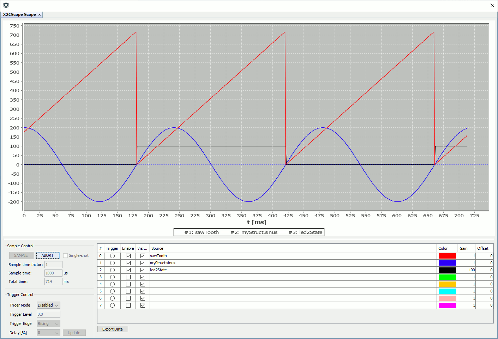

# MPLAB X Project: mc_foc_sl_fip_dspic33ck_mclv2

This is a X2Cscope demo project for [Low Voltage Motor Control (LVMC)](https://www.microchip.com/DevelopmentTools/ProductDetails/PartNO/DM330031) development board and [dsPIC33CK256MP508](https://www.microchip.com/wwwproducts/en/dsPIC33CK256MP508) microcontroller that is populated on the board. 

The purpose is to demonstrate the X2Cscope tool features like run-time watch and scope views.

The code functionality is very limited. It is generating a sawtooth signal and a sine signal. There is one LED that is blinking with the sawtooth signals period. The second LED can be controlled manually by the X2Cscope tool. The state of the SW1 can be read out by X2Cscope.

## Getting Started

The demo is ready to use with the [listed hardwares below](#hardware).

1. Clone or Download project to mc_foc_sl_fip_dspic33ck_lvmc.x folder. (Keep the folder name)
2. [Connect Hardware](#connectors-used)
3. Open project with MPLAB X
4. Build project then program the HW
5. Press S3 to start to spin
6. Use POT to control speed and direction

## Monitoring signals

Demo is shiped with run time monitoring and tuning feature. Below signals are recorded during a controlled acceleration.

The X2C Communicator tool and its scope feature using the UART to transfer data from and to the HW. To use this feature follow the steps:

1. Open MPLAB X then MCC:  
2. Open X2C library window: 
3. Open the model: 

### Hardware

* **LVMC dev board:** [DM330031](https://www.microchip.com/DevelopmentTools/ProductDetails/PartNO/DM330031) Low voltage motor control development board with [dsPIC33CK256MP508] (https://www.microchip.com/wwwproducts/en/dsPIC33CK256MP508) MCU populated on board

### Connectors used:

* **M1/M2/M3:** Motor  phases connected (Sequence is important with sensor mode, but not with sensorless mode)
* **J1/J2:** 24V Power supply
* **J13 USB:** PICkit on board 4 (PKOB4) programmer debugger
* **J6 USB-UART:** Used to connect UART to computer (Optional for run-time monitoring and parameter tuning)
* **J8 QEA/QEB:** Motor encoder A and B channels connected (Optional for sensor operation mode)
* **J8 +5V/DGND:** Encoder supply connected (Optional for sensor operation mode)

   

### Configuration

LVMC board is used in the default configuration. 

The LVMC board is capable to configure different signal routing modes by zero Ohm jumper resistors. For details see the [LVMC user guide](https://www.microchip.com/DevelopmentTools/ProductDetails/PartNO/DM330031). 

* **Routing:** Internal OP_AMP is used
* **UART:** J6 MCP2200 USB-UART chip is used for X2C run-time debugging 
## Peripheral settings and I/O connections: 

   Peripherals are configured by [MCC](https://microchipdeveloper.com/mcc:mccgpio) according to the LVMC board [schematics](https://www.microchip.com/DevelopmentTools/ProductDetails/PartNO/DM330031).

   If you need more details of peripheral configuration, just open MPLAB X then MCC with the MCC button:  

### Software

To start the motor control demo, only the MPLAB X IDE and XC16 compiler is required. 
If SW modification and Runtime Monitoring feature are required then all SW tools will be needed listed here:

* [MPLAB X](https://www.microchip.com/mplab/mplab-x-ide) Integrated Development Environment. 
* [XC16 Compiler:](https://www.microchip.com/mplab/compilers) Compiler for the Microchip 16bit MCUs

### Built With

* [XC16 v1.60](https://www.microchip.com/mplab/compilers) - Microchip C compiler for 16bit micros
* [X2C v6.3](https://x2c.lcm.at/) - Generate C code from Scilab/XCOS model
* [MCC v4.0.2](https://www.microchip.com/mplab/mplab-code-configurator) - Configure peripherals and generate low levev drivers